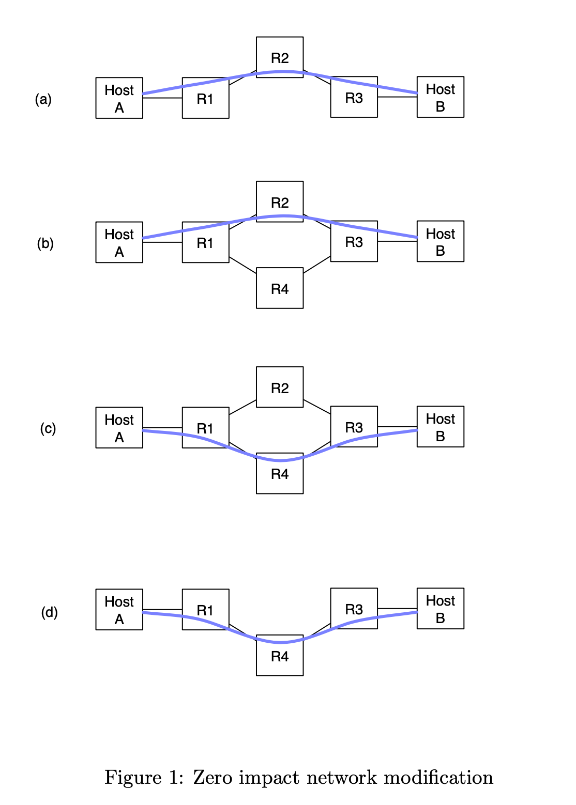

# Simple OSPF Topology

## Goal 

* Dynamically instantiate a simple three node router topology between two end hosts HostA and HostB. (Figure 1(a).) Both the hosts and the routers will be Docker containers in a Linux environment. You will use Docker configuration files and commandline functions to create this initial topology dynamically (including IP subnet assignments suitable for a routed network topology).

* The routers in this topology (R1, R2 and R3) will run the Quagga routing software. You will have to create configuration files for these routers to enable them to run OSPF. At this stage the two hosts should be able to communicate via the R1-R2-R3 path as shown in Figure 1(a).

* You will then have to introduce another router into the topology, as shown in Figure 1(b), via Docker commands and configuration files. You will have to programmatically configure R4 to take part in OSPF with the other routers.

* Our eventual goal is to remove R2 from the topology. However, we want to do this without causing any packet drops. With OSPF this can be achieved by setting the OSPF links weights such that router R1 will prefer the path via R4 towards HostB, and similarly R3 will prefer the path via R4 towards HostA. You will have to programmatically set the link weights between R1 and R2 and between R2 and R3 to realize this. The desired change in traffic flow is depicted in Figure 1(c).

* Finally you will have to programmatically remove R2 from the topology to arrive at the topology shown in Figure 1(d).

## How To Run 

1. run lab/setup.h to install dependencies. 
2. use the orchestrator **orch** to manipulate the routing topology as desired. 

## Using the orchestrator 

Usage: ./orch -h|-help -start-all -u|-up <"list"> -s|-stop <"list"> -r|-routes <"list"> -e|-endpoint <ha|hb> -m|-move <north|south> -k|-kill

### Examples: 

#### Get Help: 
./orch -h

./orch -help 

#### Start All Six Containers, Start All OSPF Routs, Set Endpoint Routes: 

./orch -start-all

#### Start Up Containers: 
##### Valid options: ha, hb, r1, r2, r3, r4

./orch -u "ha hb r1 r2 r3" 

./orch -up "r4" 

./orch -up "ha hb r1 r2 r3 r4" 

#### Stop Containers: 
##### Valid options: ha, hb, r1, r2, r3, r4
./orch -s "r2" 
./orch -stop "r4" 

#### Setup OSPF Routes on Containers: 
##### Valid options: r1, r2, r3, r4
./orch -r "r1 r2 r3" 
./orch -routes "r4" 

#### Setup Routes on an Endpoint: 
./orch -e <ha|hb>

#### Set Traffic Path: 
./orch -m <north|south> 

#### Kill All Docker Containers and Docker Networks: 
./orch -k 

